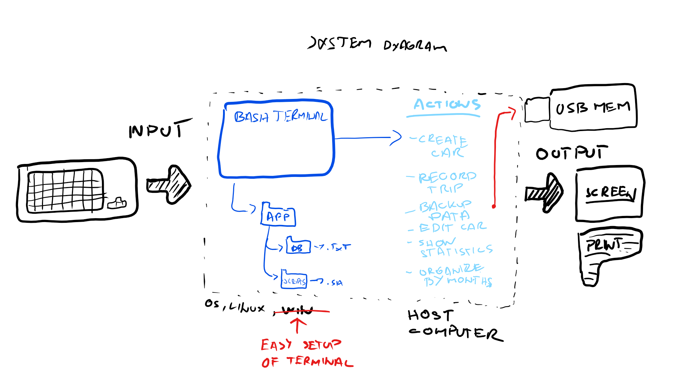

Car Rental Minimal App
===========================

A car rental management minimal app in Bash.

Contents
-----
  1. [Planning](#planning)
  1. [Design](#design)
  1. [Development](#development)
  1. [Evalution](#evaluation)

Planning
----------
### Defining the problem (Topic 1.1.1)
We need to create simple program, based in terminal.
Installation must be easy. User wants that easy commands
allow him to create car, record a trip, querythe trip
history of a car, edit and delete car. It is specificly 
requested that commands for entering the trip distance are 
easy. We need to add bascis permenet storage system and backup,
comamand to see total statistics is neccesery.

### Solution proposoed
Because user wants simple program based in terminal, I will be using bash. 


### Sucess Criteria
This are mesurable outcomes
1. A car can be created and stored in database
1. A car infromation can be edited
1. A car can be deleted from the database
1. The installation is simple-> one step process
1. A summary (total/avrage distance traveled) can be generated for particular car
1. Trips can be recorded and stored for an existing car
1. A basic database system is implemented
1. A baasic backup funcionality is avelible

Design
---------
### First sketch of the system

**Fig. 1** This is first shetch of the system showing main input/output coponets, actions, and software requirements.


Development
--------
**Install program**
```sh
#!/bin/bash

#This file creates the folder structure for the
#minimal Car Rental App

echo "Starting the installation"
echo "Default install path is /home/filip/Desktop"
echo "Press Enter to continue installation, if you"
echo "want to change install path press x  "

read choice

#checking what user eneted
if [[ ($choice == x) ]];then
    echo "Enter installation path, then press Enter"
    read path

    #movih to the desired location
    cd $path
    echo "moving to $path"

else
  #moving to default location
  cd /home/filip/Desktop
fi

#Create App folder
mkdir RentalCarApp

#move to created folder
cd RentalCarApp

#create for database and scripts
mkdir database
mkdir scripts

echo "structure created successfully"
``` 
This file works

**Uninstall program**
```sh
#!/bin/bash

#This file uninstalls RentalCarApp
#By deleting all folders

#checking if user didn't click run uninstall program by accident"
echo "Are you sure you want to uninstall RentalCarApp?"
echo "( Press enter to continue press x to cancel )"

#reading users decision
read cancel

if [[ ($cancel == x) ]];then
  echo "canceling..."
  sleep 2
  exit

else
  cd /home/filip/Desktop
  rm -r RentalCarApp
  echo "RentalCarApp succesfully uninstalled"
fi
```
This file works

**Create a new car - file**
1. Get inputs
2. Check number of arguments if 4 then continue, if not exit "message"
3. Write to main file with one extra line. NOt erasing other entries
4. Create car trip file with license plate.txt

```sh
#!/bin/bash

#This program creates new car based on arguments entered by user
#it will crate maincar file and record file for the car


#checking if user enetered 4 arguments, ad exiting the program if not
if [[ ($# -ne 4) ]]; then
  echo "Incorrect input. Please enter Plate, Model, Color, Passengers. Exiting the program... "
  exit
fi


#All data is entered, program will continue
plate=$1
model=$2
color=$3
pp=$4

#adding new entry to file maincarfile.txt
echo "$plate $model $color $pp" >> ~/Desktop/RentalCarApp/db/maincarfile.txt
echo "" > ~/Desktop/RentalCarApp/db/$plate.txt
bash frame.sh "Car created successfully"
```

**Create record file for a car**
```sh
#!/bin/bash

#This program will recor car trip and
#write data into plate.txt file

#changing arguments into variables
plate=$1
km=$2
dateout=$3
datein=$4


#moving to instalation folder
cd ~/Desktop/RentalCarApp/db/

#checking if file plate.txt exist, and if user eneterd
#4 arguments
if [[ ($# -ne 4) ]]; then
  echo "Incorrect input. Please enter Plate, kilometers, dateout, datein Exiting the program... "


elif [ ! -f "$1.txt" ]; then
  echo "Car don't exist, please crate a car, exiting the program... "

#creating plate.txt file with data about each specific car
else
  echo "$plate $km $dateout $datein" >> $plate.txt
  echo "Trip recorded, exiting the program"
fi

```
Evaluation
-----------


