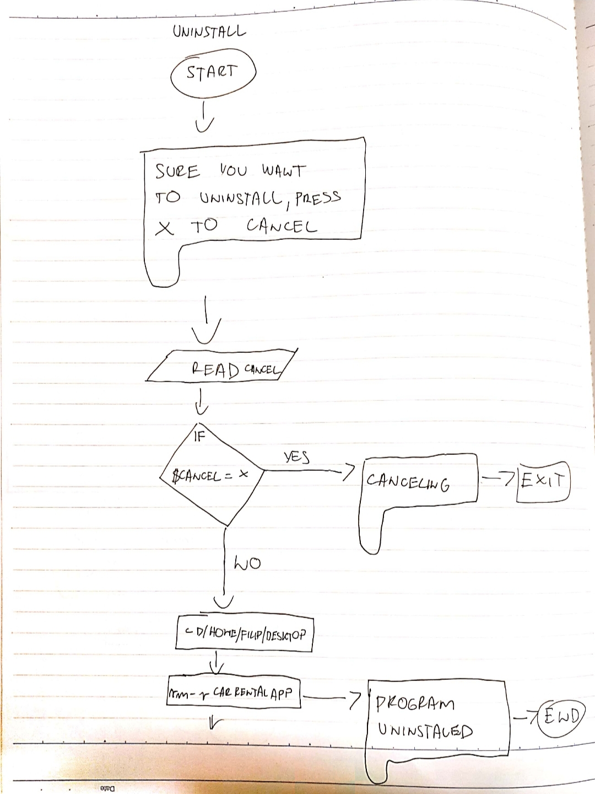

Car Rental Minimal App
===========================

A car rental management minimal app in Bash.

Contents
-----
  1. [Planning](#planning)
  1. [Design](#design)
  1. [Development](#development)
  1. [Evalution](#evaluation)

Planning
----------
### Defining the problem (Topic 1.1.1)
We need to create simple program, based in terminal.
Installation must be easy. User wants that easy commands
allow him to create car, record a trip, get trip
history of a car, edit and delete car. It is specificly 
requested that commands for entering the trip distance are 
easy. We need to add bascis permenet storage system and backup,
comamand to see total statistics is neccesery.

### Solution proposoed
Because user wants simple program based in terminal with simple comands, I will use bash language, which allows me to crate simple commands and program operating in terminal. 


### Sucess Criteria
This are mesurable outcomes
1. A car can be created and stored in database
1. A car infromation can be edited
1. A car can be deleted from the database
1. The installation is simple-> one step process
1. A summary (total/avrage distance traveled) can be generated for particular car
1. Trips can be recorded and stored for an existing car
1. A basic permanent storage system and backup	


Design
---------
### First sketch of the system

**Fig. 1** This is first shetch of the system showing main input/output coponets, actions, and software requirements.

### Testing plan

**Fig. 2** This is flowdiagram for testing the program

### Steps for every syntax
**Install program**
1. Tell user what default path is, offer him option to continue or to change path
1. Move to install location
1. Create all necessery folders
1. Copy scripts from download location

**Uninstall script**
1. Move to program location
1. Offer user option to cancel unistallation
1. Delete whole program folder

**Fig. 3** This is flow diagram for uninstall script

**Backup database script**
1. Get location where user wants to back up data base
1. Copy databse to location chosen by user

**Create a new car - script**
1. Get inputs
1. Check number of arguments if 4 then continue, if not exit "message"
1. Write to main file with one extra line. NOt erasing other entries
1. Create car trip file with license plate.txt

**Record car trip script**
1. Get arguments from user, change them into variables
1. Check number of arguments (license, plate, dateout, datein)
1. Add data enetered by user to $plate.txt file

**Fig. 4** This is flow diagram for record script

**Delete a car script**
1. Ask user which car to delete
1. Check if user chose correctly (Just one argument, than check if license exist or not)
1. Delete chosen $plate.txt file and car entery in maincarfile.txt

**Fig. 5** This is flow diagram for delete script

**Create summary script**
1. Get first argument from user $!
1. Check if there is just one argument
1. If user eneters license plate as argument, print total kilometers for this license plate
1. If user enters all as an argument then show him total kilometers for all cars

**Edit car script**
1. This script first check if user eneterd correct number of arguments
1. Then checks if car we want to edit even exists
1. Than it finds car user wants in main car file
1. Deletes it and than add the new data


Development
--------
**Install program**

```sh
#!/bin/bash

#This file creates the folder structure for the
#minimal Car Rental App

echo "Starting the installation"
echo "Default install path is /home/filip/Desktop"
echo "Press Enter to continue installation, if you"
echo "want to change install path press x  "

read choice

#checking what user eneted
if [[ ($choice == x) ]];then
    echo "Enter installation path, then press Enter"
    read path

    #movih to the desired location
    echo "Starring the installation"
    cd ~/$path
    #Create App folder
    echo "Creating folders"
    mkdir CarRentalApp
    cd CarRentalApp
    mkdir db
    mkdir scripts
    mkdir tests


    cp -a ~/Downloads/CarRentalAppInstall/scripts/. ~/$path/CarRentalApp/scripts
    cd scripts
    bash frame.sh "Install successfully"

else
  #moving to default location

    echo "Starring the installation"
    cd ~/Desktop
    #Create App folder
    echo "Creating folders"
    mkdir CarRentalApp
    cd CarRentalApp
    mkdir db
    mkdir scripts
    mkdir tests


    echo "Set up scripts file"
    cp -a ~/Downloads/CarRentalAppInstall/scripts/. ~/Desktop/CarRentalApp/scripts
    cd scripts
    bash frame.sh "Install successfully"
fi
```
This file works
1. If command which is used in this program executes folowing command if criteria in brackets is true, if not it moves to next elif or else line till we end it with fi comand.
2. cp commands copies folder from first specified location to second specified location
```sh
cp -a ~/Downloads/CarRentalAppInstall/scripts/. ~/Desktop/CarRentalApp/scripts 
```
3. Cd is used to change directory``` cd ```
4. mkdir is used to make directroy (fodlder) ``` mkdir ```
5. Command ``` echo ``` is used to print text to the user

**Uninstall script**

```sh
#!/bin/bash


#This file uninstalls RentalCarApp
#By deleting all folders

#checking if user didn't click run uninstall program by accident"
echo "Are you sure you want to uninstall RentalCarApp?"
echo "( Press enter to continue press x to cancel )"

#reading users decision
read cancel

if [[ ($cancel == x) ]];then
  echo "canceling..."
  sleep 2
  exit

else
  cd /home/filip/Desktop
  rm -r RentalCarApp
  echo "RentalCarApp succesfully uninstalled"
fi
```
This file works if user confirms default install location. If program is installed somwhere else than uninstall doesn't work.
1. Command ``` rm -r ``` is used to delete folder with everything in it

**Backup database script**
```sh
#!/bin/bash

#This program will backup the entirity of the database folder within the MinimalCarRental application.

location=$1

#We check if user eneterd just one argument
if [[ $# -ne 1 ]]; then
	echo "Sorry, there was an error with backing up your files."
	exit
else
  #we copy database
	cp -a ~/Desktop/RentalCarApp/db $location
	echo "Successfully backed up into $location."
fi
```
This program works.
It is hard for user to specifiy backup location, this should be considered and fixed. I will work on that if I have any time left.
1. To get first argument we use ``` $1 ```
1. To check number of arguments use  ``` $# ```

**Create a new car script**

```sh
#!/bin/bash

#This program creates new car based on arguments entered by user
#it will crate maincar file and record file for the car


#checking if user enetered 4 arguments, ad exiting the program if not
if [[ ($# -ne 4) ]]; then
  echo "Incorrect input. Please enter Plate, Model, Color, Passengers. Exiting the program... "
  exit
fi


#All data is entered, program will continue
plate=$1
model=$2
color=$3
pp=$4

#adding new entry to file maincarfile.txt
echo "$plate $model $color $pp" >> ~/Desktop/RentalCarApp/db/maincarfile.txt
echo "" > ~/Desktop/RentalCarApp/db/$plate.txt
bash frame.sh "Car created successfully"
```
This program works
1. > is used to create new file and add entered text to file, but if overwrites old file with the same name  ``` echo "" > ~/Desktop/RentalCarApp/db/$plate.txt ```
2. >> is used to create new file or add text to already existing file ``` echo "$plate $model $color $pp" >> ~/Desktop/RentalCarApp/db/maincarfile.txt ```

**Frame script**
```sh
#!/bin/bash

#counting number of letters in a word
word=$*
len=${#word}


#calculating position of a word
x=1
((dev=$len/2))
((pos=49-$dev))

  #calibrating position depends on odd or even number of characters
  ((test=$len%2))
  echo $test
  if [[ ($test -eq 0) ]]; then
    x=0
  fi


#repeating sign % for 100 times
for (( i=0; i<100; i++ ))
do
  echo -n "%"
done
echo ""

#making one line of space and side signs
echo -n "%"
for (( i=0; i<98; i++ ))
do
  echo -n " "
done
echo "%"

#making another line of space and side signs
echo -n "%"
for (( i=0; i<98; i++ ))
do
  echo -n " "
done
echo "%"

      #positioning the word
      echo -n "%"
      for (( i=0; i<$pos; i++))
      do
        echo -n " "
      done
      #printing out the word
      echo -n $word
      #positioning the word
      for (( i=$x; i<$pos; i++))
      do
        echo -n " "
      done
      echo "%"


#making one line of space and side signs
echo -n "%"
for (( i=0; i<98; i++ ))
do
  echo -n " "
done
echo "%"


#making another line of space and side signs
echo -n "%"
for (( i=0; i<98; i++ ))
do
  echo -n " "
done
echo "%"

#making bottom line 
for (( i=0; i<100; i++ ))
do
  echo -n "%"
done
echo ""
```
This script is used to print messeges to the user in frame. Messege is always positioned in the middle of the frame.
1. To get all arguments I used comand ``` $* ```
2. TO count number of letters in a word or string I used command ``` ${#word} ```

**Create record file for a car**

```sh
#!/bin/bash

#This program will recor car trip and
#write data into plate.txt file

#changing arguments into variables
plate=$1
km=$2
dateout=$3
datein=$4


#moving to instalation folder
cd ~/Desktop/RentalCarApp/db/

#checking if file plate.txt exist, and if user eneterd
#4 arguments
if [[ ($# -ne 4) ]]; then
  echo "Incorrect input. Please enter Plate, kilometers, dateout, datein Exiting the program... "
  cd ..
  cd db
  ls

elif [ ! -f "$1.txt" ]; then
  echo "Car don't exist, please crate a car, exiting the program... "

#creating plate.txt file with data about each specific car
else
  echo "$km $dateout $datein" >> $plate.txt
  cd ..
  cd scripts
  bash frame.sh Trip recorded, exiting the program

fi
```
This program works
1. To add text to existing file I used ``` echo "text" >> file.txt ```


**Delete a car script**

```sh
#!/bin/bash


#This prgoram will delete car entery by users choice

#moving to db directroy
cd ..
cd db

#Checking if user entered argument, if not giving him options
if [[ $* == "" ]]; then
  echo "Incorrect choice, please choose car from the list bellow: "
    ls

#deleting file if user entered correct argument
elif [[ -f "$*.txt" ]]; then
  rm $*.txt
  #delete whole line which includes the plate
  sed -i "/$1/d" maincarfile.txt
  cd ..
  cd scripts
  bash frame.sh "The car information was successfully deleted"
  echo "Car deleted succesfully!"
  exit
#Checking if user entered correct argument, if not giving him options
else
  echo "Incorrect choice, please choose car from the list bellow: "
  ls
fi


#getting users delete choice
echo "Choose which car you want to delete IMPORTANT - LEAVE OUT .txt ENDING OF A FILE"
read car
#checking if choice is correct, and deleting chosen car
if [[ -f "$car.txt" ]]; then
  rm $car.txt
  echo "Car deleted succesfully"
  #delete whole line which includes the plate
  sed -i "/$1/d" maincarfile.txt
  cd ..
  cd scripts
  bash frame.sh "The car information was successfully deleted"
  exit

#if user did mistake entering the car name, exiting the program
else
  echo "Incorrect choice, exiting the program!"
  exit
fi
```

1. 29th Oct This program is put together from few differend programs but never tested. I need to test it.
2. 30th Oct First run of the program, program not working, it does not delete car from maincar file, problem is in syntax which is differend for macOS and linux ``` sed -i '' "/^$license/d" maincarfile.txt ```
3. 30th Oct Second run of the program, program works correctly. If syntax is differend in macOS and Linux, does that mean that program doesn't work on macOS? I will test that next time ``` sed -i '' "/^$license/d" maincarfile.txt ```
([Source](https://likegeeks.com/sed-linux/), published 19. Feb 2017, retrived 28. Oct 2019)
4. This comand is used to search for the line that starts with argument entered by the user and delete it in file defined ``` sed -i "/$1/d" maincarfile.txt ``` 
5. ``` ls ``` lists all the files in current folder

**Create summary script**

```sh
#!/bin/bash

#This pogram will add kilometers in one car.txt file

#moving to right location
cd ..
cd db

#checking if user enetred right arguments
if [ $# -ne 1 ]; then
    echo "Enter license plate"
    ls
    exit
fi

file=$1

#Printing total ditance for all cars if user enters all as an argument
if [ $file == all ]; then
    #Calculating total distance
    total=0
    #comand read used with while loop will read the file
    # chosen od the end of loop done < "file.txt" line by line

    #this will loop throug all the txt files in folder
    for f in *.txt;
    do
        #This if sentance will avoid maincarfile.txt
        if  [[ ($f == "maincarfile.txt") ]];then
            continue

        fi

        while read line;
        do
          #for loop will go throug line word by word
          for km in $line
          do
            (( total=$km+$total ))
            #break will break the loop after first cycle
            break
          done
        done < "$f"
    done

    #Printing out the results with frame
    cd ..
    cd scripts
    bash frame.sh "TOTAL DISTANCE TRAVELED BY ALL CARS WAS: $total"
    exit

elif [ ! -f "$file.txt" ]; then
  echo "File for car $file does not exist."
  exit
fi


#Calculating total distance for one car
total=0
#comand read used with while loop will read the file
# chosen od the end of loop done < "file.txt" line by line
while read line;
do
  #for loop will go throug line word by word
  for km in $line
  do
    (( total=$km+$total ))
    #break will break the loop after first cycle
    break
  done
done < "$file.txt"

#Printing out the results with frame
cd ..
cd scripts
bash frame.sh "TOTAL DISTANCE TRAVELED FOR $file was: $total"
```

This program works

This script is used go thorugh all .txt files in the folder:
```sh
for f in *.txt;
do
done
```

This script is used to read all the words if file defined at the end. While loop goes through all the lines in file, for loop goes through every word in line.:
```sh
while read line;
        do
          for km in $line
          do
            
          done
        done < "$f"
```


**Edit car script**

```sh
#!/bin/bash
#This program edit the information of an exiting car in the
#maincarfile
#user enters [license place] [model] [color] [pp]

#checking if user eneterd correct number of arguments
if [ $# -ne 4 ]; then
  echo "Error with the number of arguments"
  echo "Enter License Model Color Passengers"
  cd ..
  cd db
  ls
  exit
fi

#Making arguments variables
license=$1
maker=$2
model=$3
pp=$4

#Changing to right directory
cd ../db

#Checking if wanted car exists
if [ ! -f "$license.txt" ]; then
  echo "File not found!"
  cd ..
  cd db
  ls
fi

#find the line with the given car plate and delete it
sed -i "/^$license/d" maincarfile.txt
#add the new information
echo "$license $maker $model $pp" >> maincarfile.txt
cd ../scripts
bash frame.sh "Car edited successfully"
```

1. 29th Oct Program is just copied, not tested yet.
2. 30th Oct First run does not delete car from maincar file, it just adds new entery, problem is in syintax, it is differend on macOS and Linux ``` sed -i '' "/^$license/d" maincarfile.txt ``` 
sed command is used to search for line in a file defined, that starts with wanted string ($license in our case) and deletes it
3. 30th Oct Second run program works correctly ```sh sed -i "/^$license/d" maincarfile.txt ```

**User documentation man pages**
They are stored in /usr/share/man/man6, this is games category.

**Uninstall man page**
```sh
.TH man 6 "30 Oct 2019" "1.0" "uninstall man page"
.SH NAME
uninstall \- uninstall CarRentalApp
.SH SYNOPSIS
bash uninstall.sh 
.SH DESCRIPTION 
uninstall is a script that uninstalls CarRentalApp (deletes all files)
.SH EXAMPLES 
bash uninstall.sh
.SH AUTHOR
Filip Ignijic
```
**Summary man page**
```sh
.TH man 6 "30 Oct 2019" "1.0" "summary man page"
.SH NAME
summary \- summary of car trip or all car trips
.SH SYNOPSIS
bash summary.sh [license plate] or [all]
.SH DESCRIPTION 
summary is a script that creates a summary of all kilometers for a specified car or for all cars
.SH EXAMPLES 
bash summary.sh LJ67
.SH AUTHOR
Filip Ignijic
```
**Record man page**
```sh
.TH man 6 "30 Oct 2019" "1.0" "record man page"
.SH NAME
record \- record car trip
.SH SYNOPSIS
bash record.sh [license] [km] [date out] [date in]
.SH DESCRIPTION 
record is a script that adds new car trip to license.txt file 
.SH EXAMPLES 
bash record.sh LJ567 500 12/11/2019 15/11/2019
.SH AUTHOR
Filip Ignijic
```
**Install man page**
```sh
.TH man 6 "30 Oct 2019" "1.0" "install man page"
.SH NAME
install \- install CarRentalApp
.SH SYNOPSIS
bash install.sh
.SH DESCRIPTION 
install is a script that installs car rental app - creates all directorires and coppies all the necessery scripts
.SH EXAMPLES 
bash install.sh
.SH AUTHOR
Filip Ignijic
```
**Edit man page**
```sh
.TH man 6 "28 Oct 2019" "1.0" "edit man page"
.SH NAME
edit \- edit a car
.SH SYNOPSIS
bash edit.sh [license] [model] [color] [passangers]
.SH DESCRIPTION 
edit is a script that edits an old record of the car in maincarfile.txt and deletes the old one
.SH EXAMPLES 
bash edit.sh LXH798 Mazda Blue 4
.SH AUTHOR
Filip Ignijic
```

**TESTS**
**Create Test 1** 
First run of the program we had one issue: the test file neededto move to move to the main folder
```-sh
cd ../
```
This is necessary because the 'create.sh' resides in the main folder where as the test file is inside the /tests folder


To check that car wac created in main file (maincarfile.txt), the following command is used ```.sh lastline = $( tail -n 1 db/maincarfile.txt ) ``` . Tail reads file from the bottom, n is number of the  line

**Create Test 2** 
Everything works correctly. This is test program.
```.sh
#!/bin/bash

#This file test the firt successcriterio, namely.
#A car can be created and sotred in the database

#Step 1: creaste a car usig the script created
cd ../
bash create.sh TXM301 nissan red 9

#Step 2: check if the license file .txt was created
if [[ -f "db/TXM301.txt" ]]; then
  echo "Test one: a txt file was created inside the database: passed"
else
  echo "Test one: Error. File not found: not passed"
fi

#step 3: Check that the car was added to main File
cat db/maincarfile.txt
lastline=$( tail -n 1 db/maincarfile.txt )

#Tail read file from the bottom, now I just check if lastline matches our entry
if [[ "TXM301 nissan red 9" == $lastline ]];then
  echo "Test two: Recored was entered correctly: passed"
else
  echo "Test two: Failed"
fi
```
**Summary:** We did dynamic alpha white box testing. Dynamic means that we actually run the code, alpha means that it was runned by developers. White box testing means that we have acces to internals of the program.

**Install Test 1**
Test works, but I encountered few problems:
1. Testing is not dynamic, I am not really running the install program, just checking result after program was runed manually. If I run install program again for testing, old installation gets overwritten
1. works just for default installation path
1. There is still problem with delte program, it deletes just record files and not enteries in maincarfile
1. When I fix problem with delete file, then there is problem with test file, how to test if car was deleted in main car file

```sh
#!/bin/bash

#This program will check if program was installed corectlly

#Moving to installation location
cd /home/filip/Desktop
#Checking if main folder exists and seting first test variable to true
if [[ -d "RentalCarApp" ]]; then
  test1=true
fi


#Moving inside the folder
cd RentalCarApp
if [[ -d "db" && -d "scripts" ]]; then
  test2=true
fi

#checking if both test are positive
if [[ test1 && test2 ]]; then
  echo "Test complete, program was installed corectlly: passed "
else
  echo "Test failed, program installed incorrectly"
fi
```

**Delete test 1**
Test program works but there are still some major problems
1. There is still problem with delte program, it deletes just record files and not enteries in maincarfile
1. When I fix problem with delete file, then there is problem with test file, how to test if car was deleted in main car file

```sh
#!/bin/bash

#This program tests if delete program works propperly

#Runing create script
cd ../
bash create.sh AXT567 AUDI red 5

#Running delete program
bash delete.sh AXT567

#moving to db folder
cd  db

#checking if file is deleted
if [[ -f "AXT567" ]]; then
  echo "Test failed"
else
  echo "Test complete, car was deleted correctly: passed"
fi
```


Evaluation
-----------

### Evaluation Sucess Criteria


**Fig. 6** This is evaluation table for the program


### Improvements
1. Next time it would be good, if we have enaugh time, to create test programs for all of the scripts. Major problem current program has right now, which is making it harder to use (not simple as user wanted), is problem with installation and backup path. We don't know user's computer configuration and for user is hard to enter path with correct syntax. Antoher problem regarding paths is that we offer user option during installation process to change installation path. If he changes installation path that our uninstall script is not working anymore.

1. If we merged everything in one program which would lauch other pograms, user would need to open just one file that would make use easier. 

1. We would make program much more user friendlly if we could show him data base in real time
